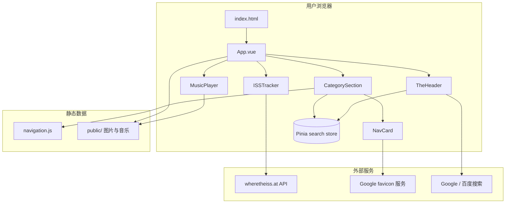

# 旅路罗盘（travel-compass）项目资源文档

本文档面向无技术背景的 Review 人员与项目协作者，汇总项目的设计、功能、技术与资源信息，用于快速了解项目全貌。

---

## 1. 项目是什么

**旅路罗盘**是一个个人导航站：把常用网站链接按分类整理在一个页面上，打开即可跳转。站点名称寓意「为旅路指引方向」。

| 属性 | 说明 |
|------|------|
| 项目名称 | travel-compass（旅路罗盘） |
| 类型 | 纯静态前端网站 |
| 仓库 | [github.com/tobenot/travel-compass](https://github.com/tobenot/travel-compass) |
| 部署方式 | GitHub Pages，推送到 `main` 分支后自动构建发布 |
| 是否需要后端 | 否，无数据库、无用户登录 |

---

## 2. 页面长什么样

页面自上而下大致分为以下区域：

```
┌─────────────────────────────────────────┐
│  顶部栏：Logo + 搜索框 + Google/百度搜索  │
├─────────────────────────────────────────┤
│  立绘肖像区（随机显示一张角色立绘）        │
├─────────────────────────────────────────┤
│  国际空间站位置卡片  │  背景音乐播放器    │
├─────────────────────────────────────────┤
│  导航分类区（多组链接卡片）               │
│    - AI创作工具                          │
│    - AI使用仪表盘                        │
│    - AI购买盯梢                          │
│    - 音乐娱乐 / 游戏资料 / 实用工具 ...   │
├─────────────────────────────────────────┤
│  页脚：版权信息                           │
└─────────────────────────────────────────┘
```

背景为海景图（`sea.png`），整体为紫金色主题，支持暗色模式（跟随系统 `prefers-color-scheme`）。

海报展示区（3 张 poster）代码已保留，当前通过开关 `SHOW_POSTERS = false` 隐藏。

---

## 3. 功能清单

### 3.1 导航链接

- 所有链接写在 `src/data/navigation.js`，按分类组织
- 每个链接包含：标题、描述、URL；部分链接有 emoji 图标
- 点击卡片在新标签页打开目标网站
- 无图标时自动拉取目标网站的 favicon（通过 Google 服务）

当前共 **9 个分类**，约 **40+ 条链接**，主要覆盖：

| 分类 | 内容方向 |
|------|----------|
| AI创作工具 | ChatGPT、DeepSeek、Gemini、即梦、Suno 等 |
| AI使用仪表盘 | API 用量、订阅管理页面 |
| AI购买盯梢 | 编程套餐购买入口 |
| 音乐娱乐 | B 站歌单与视频 |
| 游戏资料 | 矮人要塞 Wiki、独立游戏资讯等 |
| 实用工具 | 日历、翻译、去水印 |
| 效率工具 | Flomo、坚果云、Mermaid、Photopea 等 |
| 阅读 | 个人与关注的博客 |
| VRC朋友的博客 | VRChat 圈友博客链接 |

### 3.2 搜索

- 顶部搜索框可过滤当前页面的导航链接（按标题、描述匹配）
- 附带 Google、百度快捷搜索按钮，将输入内容跳转到对应搜索引擎

### 3.3 国际空间站追踪（ISSTracker）

- 每 30 秒从 [wheretheiss.at](https://wheretheiss.at) 拉取 ISS 实时位置
- 显示纬度、经度、高度、速度、所在区域（粗略地理判断）
- 附带空间站直播、维基百科、NASA 相关链接

### 3.4 背景音乐播放器（MusicPlayer）

- 播放 `public/music/background.mp3`
- 支持播放/暂停、进度条、音量、静音
- 浏览器通常阻止未交互的自动播放

### 3.5 立绘展示

- 4 张立绘图片，按权重随机显示（portrait1 权重 100，其余 20–30）
- 带浮动动画与装饰边框

---

## 4. 技术栈

| 层级 | 技术 | 版本（package.json） | 用途 |
|------|------|---------------------|------|
| 框架 | Vue 3 | ^3.3.4 | 组件化 UI |
| 状态 | Pinia | ^2.1.0 | 搜索关键词共享 |
| 构建 | Vite | ^4.x（devDep） | 开发服务器与打包 |
| 样式 | Tailwind CSS | ^3.3.0 | 响应式布局与主题色 |
| 部署 | GitHub Actions | — | 推 main 后自动构建发布到 Pages |

未使用：Vue Router（单页无路由）、后端 API、数据库、单元测试框架。

---

## 5. 项目目录结构

```
travel-compass/
├── .github/workflows/deploy.yml   # CI/CD：构建并部署到 GitHub Pages
├── docs/
│   ├── bugfix/                    # 历史问题记录
│   └── 项目资源文档.md             # 本文档
├── public/                        # 静态资源（构建时原样复制到 dist 根目录）
│   ├── images/                    # 背景、海报、立绘、封面
│   ├── music/background.mp3       # 背景音乐
│   └── logo.svg                   # 站点图标
├── src/
│   ├── App.vue                    # 根组件：布局、背景、立绘
│   ├── main.js                    # 入口：挂载 Vue + Pinia
│   ├── style.css                  # Tailwind 入口与全局样式
│   ├── components/
│   │   ├── TheHeader.vue          # 顶栏与搜索
│   │   ├── CategorySection.vue    # 分类导航列表
│   │   ├── NavCard.vue            # 单个链接卡片
│   │   ├── ISSTracker.vue         # 空间站追踪
│   │   └── MusicPlayer.vue        # 音乐播放器
│   ├── data/navigation.js         # 导航数据（核心配置）
│   └── stores/search.js           # 搜索状态
├── index.html                     # HTML 入口
├── vite.config.js                 # Vite 配置（base: '/'）
├── tailwind.config.js             # 主题色、动画
├── package.json
└── README.md                      # 原始设计方案
```

---

## 6. 架构关系



数据流要点：

1. **导航数据**：`navigation.js` → `CategorySection` → `NavCard` 渲染
2. **搜索**：`TheHeader` 输入 → Pinia `searchQuery` → `CategorySection` 过滤
3. **动态内容**：仅 ISS 位置依赖外部 API，其余均为静态

---

## 7. 核心模块说明

### 7.1 navigation.js

导航数据的唯一来源。结构：

```js
{
  title: '分类名',
  items: [
    { title: '网站名', description: '描述', link: 'https://...', icon: '🎵' }  // icon 可选
  ]
}
```

新增或修改链接：编辑此文件即可，无需改组件代码。

### 7.2 NavCard.vue

- 接收 `title`、`description`、`link`、`icon`（可选）
- 无 `icon` 时使用 `https://www.google.com/s2/favicons?domain=...` 获取网站图标
- 图标加载失败时重试同一服务

### 7.3 search.js（Pinia）

- 仅存一个字段：`searchQuery`
- 供 `TheHeader` 写入、`CategorySection` 读取过滤

### 7.4 ISSTracker.vue

- 请求：`GET https://api.wheretheiss.at/v1/satellites/25544`
- 轮询间隔：30 秒
- 区域判断为前端粗略算法（非精确地理编码）

### 7.5 MusicPlayer.vue

- 使用原生 `Audio` API
- 歌曲列表在组件内 `songs` 数组定义，当前仅一首背景音乐

---

## 8. 静态资源清单

| 路径 | 类型 | 用途 |
|------|------|------|
| `public/logo.svg` | SVG | 站点 Logo、favicon |
| `public/images/sea.png` | PNG | 全页背景 |
| `public/images/poster1–3.webp` | WebP | 海报（当前隐藏） |
| `public/images/portrait1–4.png` | PNG | 立绘随机展示 |
| `public/images/music-cover.svg` | SVG | 播放器封面 |
| `public/music/background.mp3` | MP3 | 背景音乐 |

### 静态资源路径约定

`public/` 下的文件构建后位于网站根目录。引用方式：

- **模板中写死的路径**：使用绝对路径，如 `src="/images/sea.png"`
- **脚本中动态绑定的路径**：可用 `./images/...`（见 `docs/bugfix/20250215bugfix-图片资源引用.md`）

若部署到子目录（非根路径），需同步修改 `vite.config.js` 的 `base` 配置。

---

## 9. 主题与样式

`tailwind.config.js` 定义了三套主色：

| 色系 | 用途 |
|------|------|
| primary（紫色） | 主按钮、强调、边框光晕 |
| gold（金色） | 搜索按钮、装饰 |
| dark（深紫灰） | 暗色模式背景层级 |

自定义动画：`fade-in`、`float`、`slide-up`、`glow`。

暗色模式通过 Tailwind 的 `dark:` 前缀实现，依赖系统偏好，无手动切换开关。

---

## 10. 构建与部署

### 本地开发

```bash
npm install
npm run dev      # 启动开发服务器
npm run build    # 输出到 dist/
npm run preview  # 预览构建结果
```

### 自动部署（GitHub Actions）

触发条件：推送到 `main` 分支。

流程：

1. `npm install`
2. `npm run build`
3. 上传 `dist/` 为 Pages artifact
4. 部署到 GitHub Pages

配置文件：`.github/workflows/deploy.yml`

---

## 11. 外部依赖与隐私

| 服务 | 调用方 | 数据发送 |
|------|--------|----------|
| wheretheiss.at | ISSTracker | 无用户数据，仅 GET 公开 API |
| Google favicon | NavCard | 目标网站域名 |
| Google / 百度搜索 | TheHeader | 用户输入的搜索词（跳转至第三方） |

站点本身不收集、不存储用户数据。

---

## 12. Review 检查清单

供 Review 时对照使用：

### 内容与链接

- [ ] 各分类链接是否有效、描述是否准确
- [ ] 新增链接是否放在合适分类
- [ ] 敏感或个人链接是否应公开

### 视觉与体验

- [ ] 移动端与桌面端布局是否正常
- [ ] 暗色模式下文字与背景对比度
- [ ] 立绘、背景图是否合适
- [ ] 音乐播放器是否打扰（默认不自动播放）

### 技术

- [ ] `navigation.js` 改动是否引入语法错误
- [ ] 新增 `public/` 资源路径是否正确
- [ ] ISS API 不可用时的降级表现（显示「正在建立连接...」）
- [ ] 构建是否通过：`npm run build`

### 部署

- [ ] `main` 合并后 GitHub Actions 是否成功
- [ ] 线上页面与本地预览一致

---

## 13. 已知问题与注意事项

1. **静态资源路径**：`public/` 资源在模板中宜用 `/images/...` 绝对路径；动态绑定见 `docs/bugfix/20250215bugfix-图片资源引用.md`
2. **ISS 区域判断**：基于经纬度区间的粗略估计，非精确地理位置
3. **favicon 依赖 Google**：部分网络环境可能无法加载网站图标
4. **无测试**：`package.json` 中 test 脚本为占位，无自动化测试
5. **海报区域**：`SHOW_POSTERS` 在 `App.vue` 中设为 `false`，需要时可改为 `true`

---

## 14. 常见维护操作

| 需求 | 操作位置 |
|------|----------|
| 添加/修改导航链接 | `src/data/navigation.js` |
| 更换背景图 | 替换 `public/images/sea.png` |
| 更换立绘 | 替换 `public/images/portrait*.png`，调整 `App.vue` 中 `portraitImages` |
| 更换背景音乐 | 替换 `public/music/background.mp3`，或修改 `MusicPlayer.vue` 的 `songs` |
| 显示海报区 | `App.vue` 中 `SHOW_POSTERS = true` |
| 修改主题色 | `tailwind.config.js` |
| 修改部署路径 | `vite.config.js` 的 `base` |

---

## 15. 相关文档

| 文档 | 说明 |
|------|------|
| [README.md](../README.md) | 原始设计方案（o3-mini 撰写） |
| [docs/bugfix/20250215bugfix-图片资源引用.md](./bugfix/20250215bugfix-图片资源引用.md) | 静态资源路径问题记录 |

---

*文档生成依据仓库当前代码状态，如有结构变更请同步更新本文档。*
